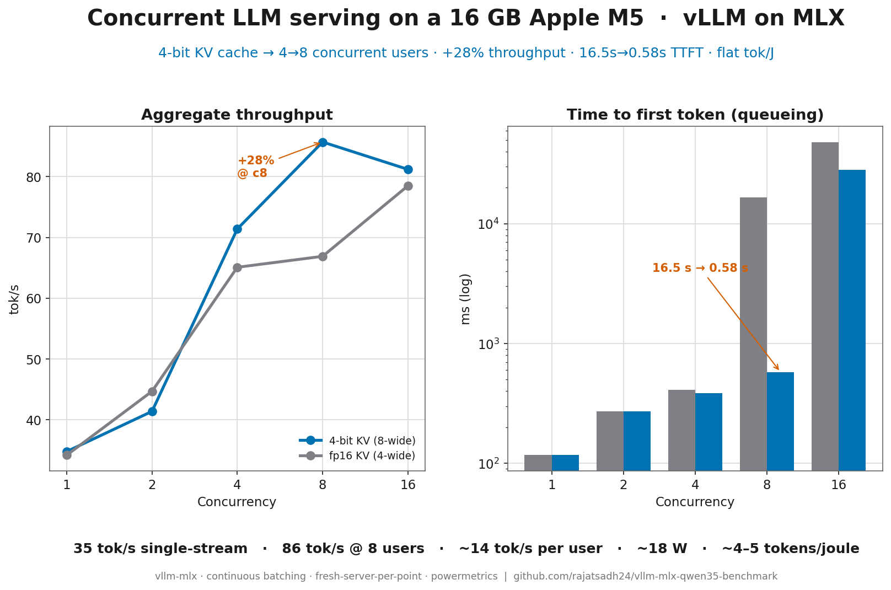
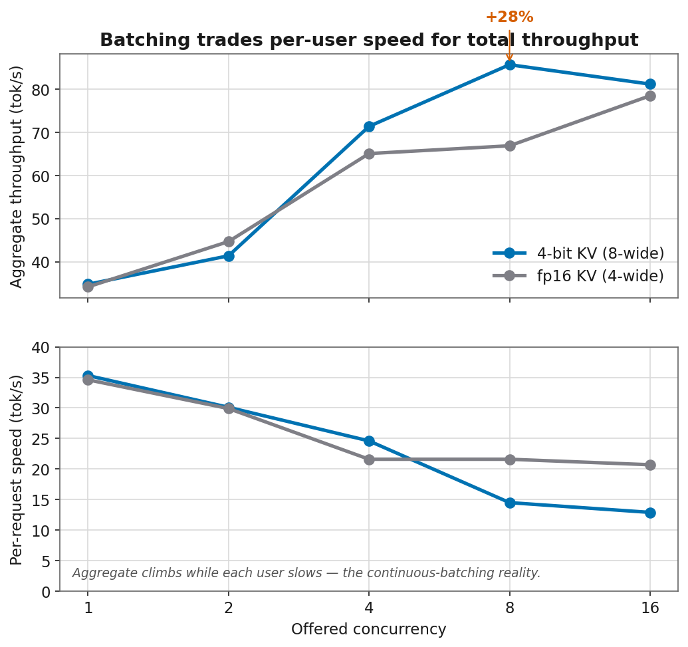
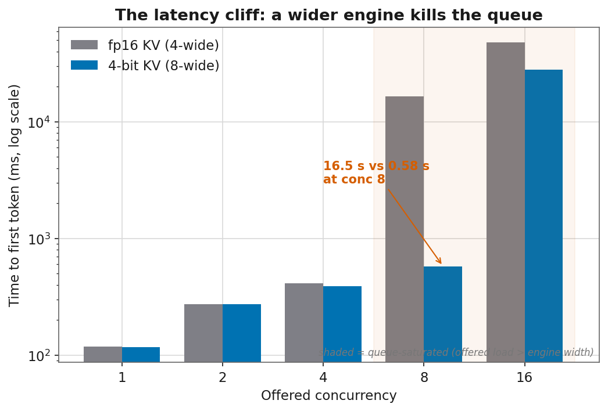
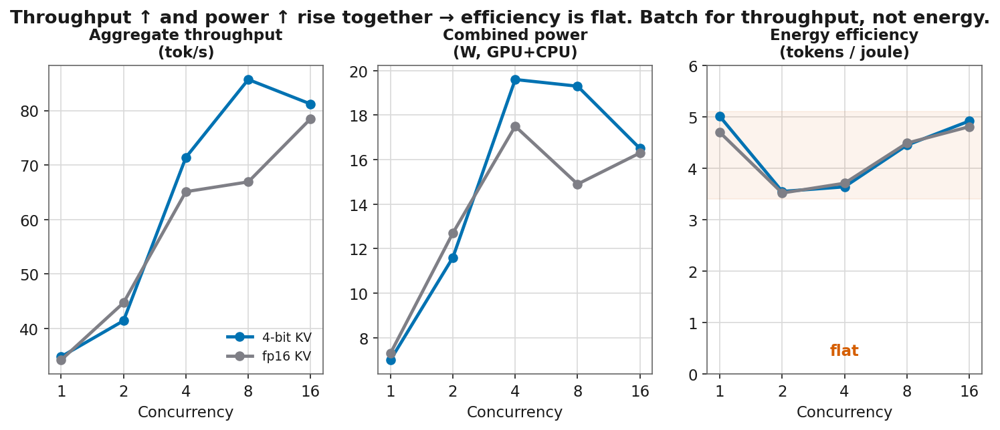
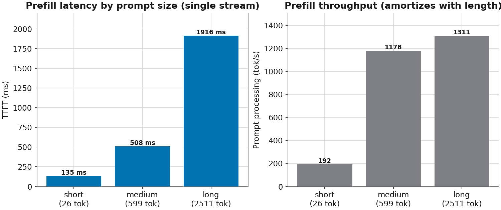
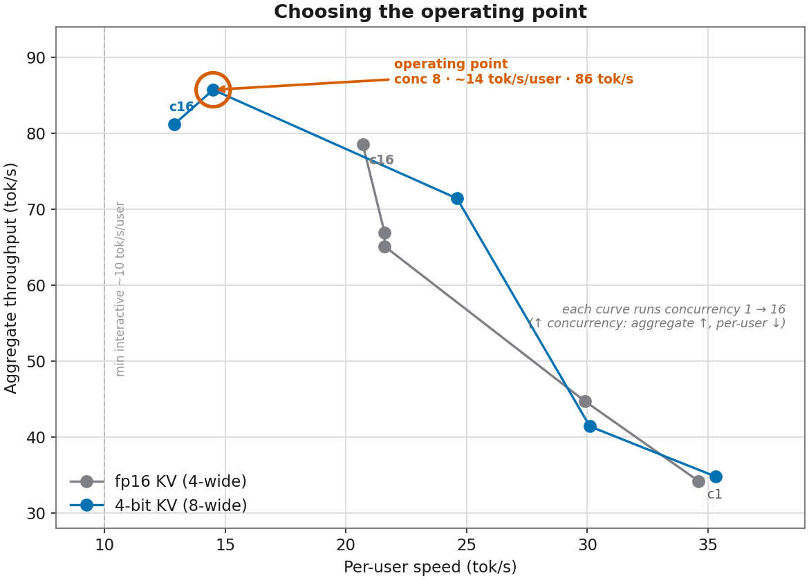
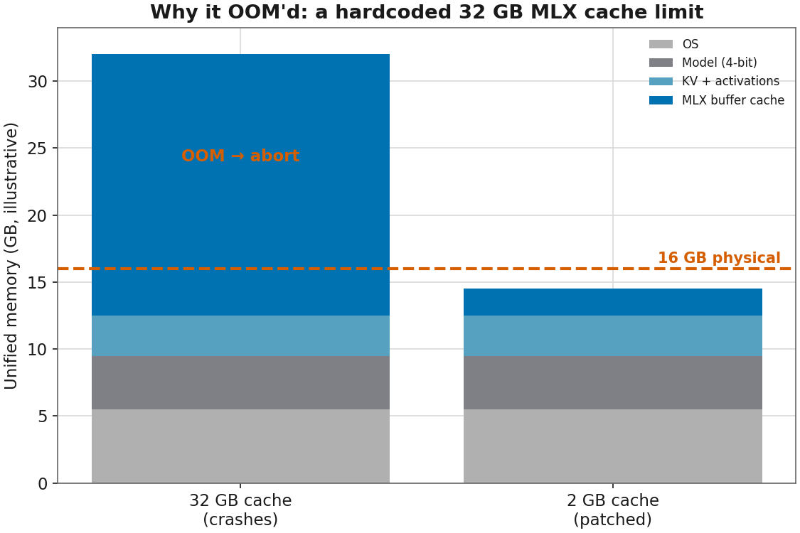

# Benchmark Report — Qwen3.5-4B-OptiQ-4bit on vLLM + MLX (16 GB Apple M5)

A self-contained concurrent-serving benchmark of the 4-bit reasoning model `qwen35-optiq`
served by **vLLM's MLX backend** on a **16 GB Apple M5** (10-core GPU, Metal 4): prefill vs
decode characterization, a 4-bit-KV-cache optimization, and energy (tokens/joule) measurement.
(The bench tool logged the chip as "Unknown" — it predates the M5.)

👉 **Read [`REPORT.md`](REPORT.md) for the full analysis.** This README is the map.

## Key result (TL;DR)

| | Baseline (fp16 KV, 4-wide) | Optimized (4-bit KV, 8-wide) |
|---|---|---|
| Peak aggregate decode | ~78 tok/s @ conc 16 | **~86 tok/s @ conc 8** |
| @ conc 8 | 67 tok/s | **86 tok/s (+28%)** |
| Real parallel streams | 4 | **8** (no OOM through conc 16) |
| Single-stream | 34.6 tok/s | 35.3 tok/s (no penalty) |
| Efficiency | ~3.5–4.8 tok/J | ~3.5–4.9 tok/J (flat) |

**Capacity claim:** ~**8 concurrent users @ ~14 tok/s each** within ~16–20 W.
**Binding constraint:** memory, not compute. Prefill single-stream ~1300 tok/s; 1.9 s TTFT on a 2511-token prompt.

## Figures



| | |
|---|---|
|  |  |
|  |  |
|  |  |

Regenerate with `python3 scripts/plot.py data/final assets` (matplotlib, colorblind-safe; PNG + SVG).

**Interactive dashboard** (hover for exact values, no static-label crowding):
**[view live ↗](https://rajatsadh24.github.io/vllm-mlx-qwen35-benchmark/assets/dashboard.html)** — or open `assets/dashboard.html` locally. Regenerate with `python3 scripts/plot_interactive.py` (requires `plotly`).

**LinkedIn carousel:** `assets/linkedin_carousel.pdf` — a 5-slide square deck for sharing. Regenerate with `python3 scripts/carousel.py`.

## Layout

```
benchmark_report/
├── README.md                     ← you are here
├── REPORT.md                     ← full report (start here)
├── assets/                       ← generated figures (PNG + SVG) + dashboard.html
├── scripts/
│   ├── run_bench.sh              ← prefill + decode envelope sweep (OOM-resilient)
│   ├── run_power_kvquant.sh      ← two-arm decode + powermetrics sweep (baseline vs 4-bit KV)
│   ├── power_summary.py          ← quick tok/J table (during-run look)
│   ├── consolidate.py            ← authoritative final-CSV generator
│   ├── plot.py                   ← static figure generator (matplotlib → assets/*.png/svg)
│   ├── plot_interactive.py       ← interactive Plotly dashboard (→ assets/dashboard.html)
│   ├── carousel.py               ← 5-slide LinkedIn carousel PDF (→ assets/linkedin_carousel.pdf)
│   └── PATCH_cache_limit.md      ← REQUIRED local patch (32 GB → 2 GB MLX cache)
└── data/
    ├── final/                    ← clean summary CSVs (cite these)
    │   ├── prefill_summary.csv
    │   ├── decode_comparison.csv
    │   └── power_stats.csv
    └── raw/                      ← all per-point CSVs + powermetrics logs + server.log
        └── archive/              ← original pre-fix runs (mostly FAIL), kept for provenance
```

## Reproducing

> **Prereqs:** AC power, Low Power Mode OFF, other apps closed (~4–5 GB used), model at
> `./models/qwen35-optiq`, and the **cache-limit patch applied** (`scripts/PATCH_cache_limit.md`)
> — without it the server OOMs on 16 GB. Run as your user, **not** `sudo` (only `powermetrics` needs sudo, handled internally).

```bash
# 1. Envelope sweep (prefill + decode, fresh server per point)
bash scripts/run_bench.sh

# 2. Two-arm decode + power (baseline fp16 KV vs 4-bit KV) + tokens/joule
bash scripts/run_power_kvquant.sh

# 3. Regenerate the clean summary CSVs from raw outputs
python3 scripts/consolidate.py data/raw data/final
```

## Gotchas this report documents (so you don't rediscover them)

1. **`FAIL` ≠ slow.** `bench-serve` fails any response truncated at `max_tokens`. This reasoning
   model overthinks and never stops unless you disable thinking
   (`--default-chat-template-kwargs '{"enable_thinking": false}'`). See REPORT §3.1.
2. **Hardcoded 32 GB MLX cache limit OOMs 16 GB Macs.** Patch to 2 GB. `--gpu-memory-utilization`
   does **not** fix it (different knob). See REPORT §3.2 + `scripts/PATCH_cache_limit.md`.
3. **Don't sweep conc 32/64 on 16 GB** — a 4B model can't fit that many parallel sequences;
   those points only measure queueing/crashes. Ladder caps at the engine width.
4. **Report power as mean, not median** — GPU power is bimodal (compute/idle duty cycle); the
   median exaggerates differences at low concurrency. See REPORT §7.

## Caveats (don't over-claim)
- Concurrency above the engine width (`--max-num-seqs`) measures queueing, not scaling.
- 4-bit KV **quality** is unmeasured here — verify before shipping.
- Single machine, 3 reps, thinking off. Energy windows include warmup (slight under-estimate).
